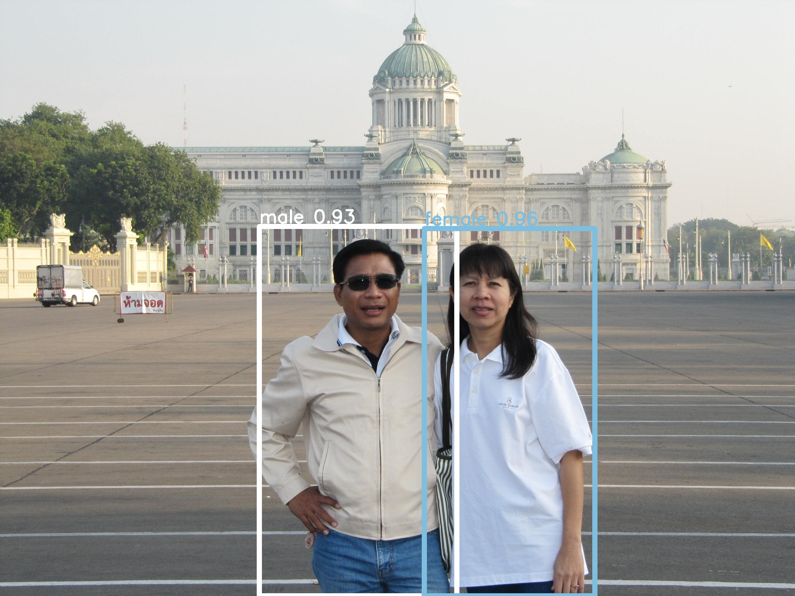

## Forked form Darkflow
Retrain for male, female detection using [open-image dataset.](https://storage.googleapis.com/openimages/web/index.html)

<p align="center">  </p>

## USAGE
Detect from Youtube live 
```
python redo.py --demo stream --url <youtube_live_url>
```
Send data using socket
```
--socket yes --hostname <receiver_IP>
```
## Open-images utils
Download by class
1. Download .csv annotation file from [open-image dataset.](https://storage.googleapis.com/openimages/web/index.html)(annotations-human-bbox.csv)
2. Edit class name in download_images_by_class.py
3. Make sure you have gsutil installed
```
python download_images_by_class.py | gsutil -m cp -I <output_destination>
```
Convert to pascal .xml (require image files and annotation)


